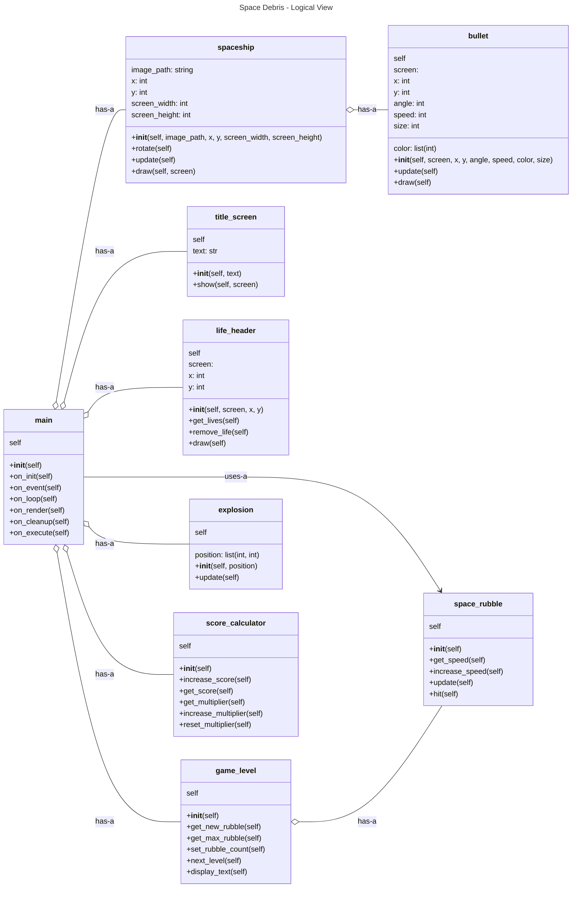
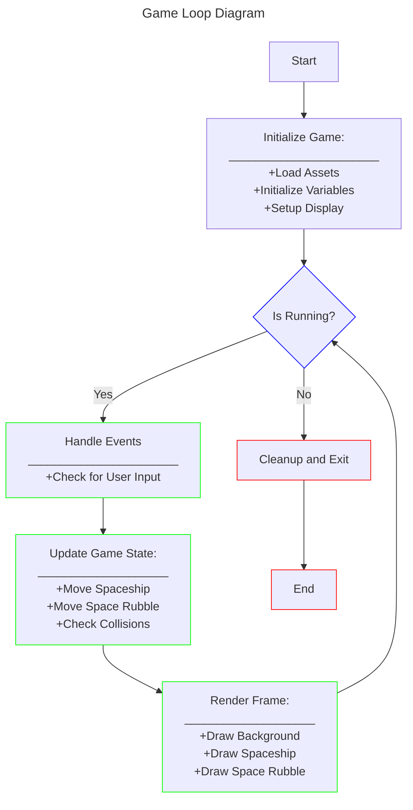
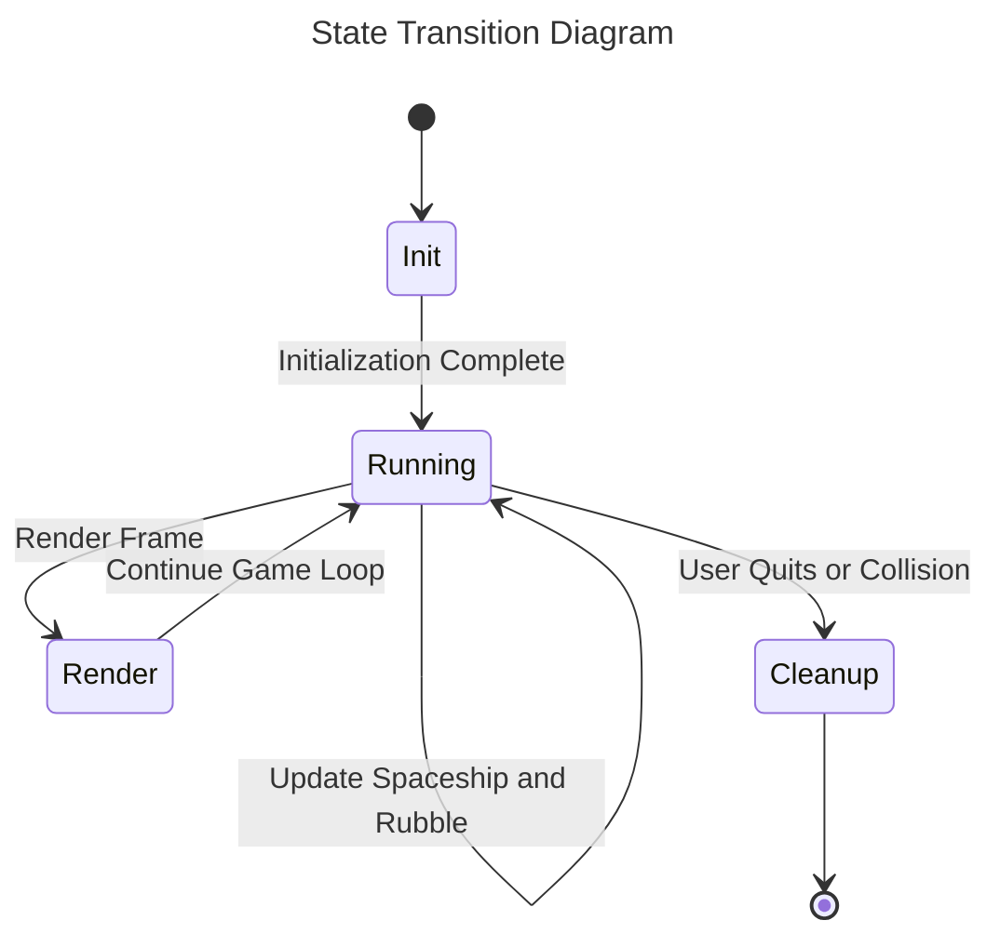

# Space Debris

**Project description:**  Welcome to Space Debris! Here you will get to test your grit in the cockpit of a state of the art, intersellar war machine!  The main objective is to clear all of the flying space rubble in the field of view which enters from both the left and right sides of the game window as well as the top and bottom. Fire projectiles at the incoming danger confetti to see it reduce in size. Keep shooting until it is all gone and do not forget to fire up the boosters if something gets a little too close for comfort.  If you are able to clear all of the space junk, you have cleared the level and will advance.  If an asteroid hits your ship then lights out and you lose a life.  Use caution, you only have three lives available to make it to the end of the game and each time you advance, so will the difficulty. To keep things interesting, your score for each game is displayed at the top left of the game screen.  Each time you play, try and beat your last score!  There is also a point multiplier displayed next to your score.  The more space rocks you remove without dying, the higher your multiplier will go.  Don't forget to chase down the green arrows that appear on the screen!  These are upgrades that will enhance your ship and weapons.  Have fun smashing rocks and trying to make it to the end!

## Requirements

 - 1. Python 3.2 or above
   3. Python Libraries:
      - Pygame
      - Typing
      - Random
      - Math
## System Design

## Logical Flow of the Game Loop

## State Diagram

     
## How to Use

To play the game, download the GitHub zip file or clone the repository.  Run the main.py file.  See **Game Controls** for player movement and action.

## How to test

To test, ensure that you have pytest installed using pip install pytest, then call python -m unittest discover tests

## Game Controls
- **Mouse** Select start, resume, and quit
- **Left Arrow:**  Rotate ship to the left
- **Right Arrow:** Rotate ship to the right
- **Up Arrow:** Move ship forward across game screen
- **z:** Fire bullets at asteroids
- **ESC** Opens pause menu

## Authors
Mark Meta\
Tyrek Blanks\
Andrew Vazzano\
Marcus Snell

