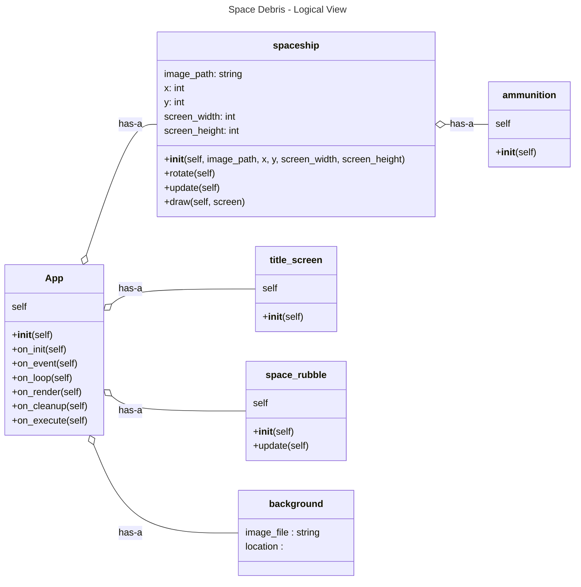
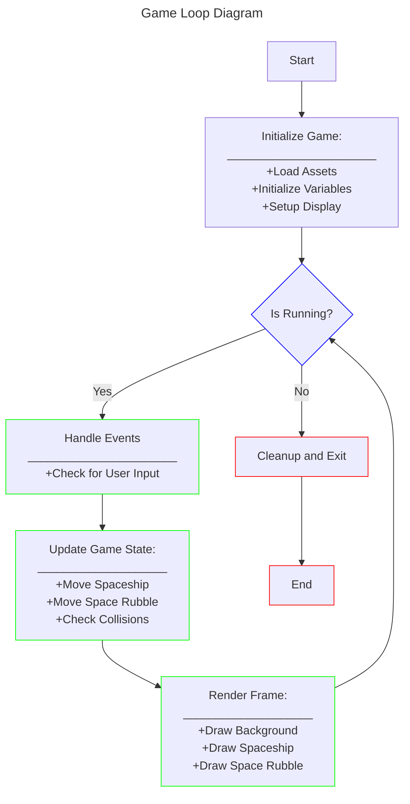

# Space Debris

**Project description:**  Welcome to Space Debris! Here you will get to test your grit in the cockpit of a state of the art, intersellar war machine!  The main objective is to clear all of the flying space rubble in the field of view which enters from both the left and right sides of the game window. Fire projectiles at the incoming danger confetti to see it reduce in size. Keep shooting until it is all gone and do not forget to fire up the boosters if something gets a little too close for comfort.  If you are able to clear all of the space junk, you have cleared the level and will advance.  If an asteroid hits your ship then lights out and you lose a life.  Use caution, you only have three lives available to make it to the end of the game and each time you advance so will the difficulty.  Have fun smashing rocks and trying to make it to the end!

## Requirements

 - 1. Python 3.2 or above
   3. Python Libraries:
      - Pygame
      - Pickle
      - Random
      - Math
## System Design

## Logical Flow of the Game Loop

     
## How to Use

To play the game, download the GitHub zip file or clone the repository.  Run the main.py file.  See **Game Controls** for player movement and action.

## Game Controls
- **Left Arrow:**  Rotate ship to the left
- **Right Arrow:** Rotate ship to the right
- **Up Arrow:** Move ship forward across game screen
- **Spacebar:** Fire bullets at asteroids

## Authors
Mark Meta\
Tyrek Blanks\
Andrew Vazzano\
Marcus Snell

